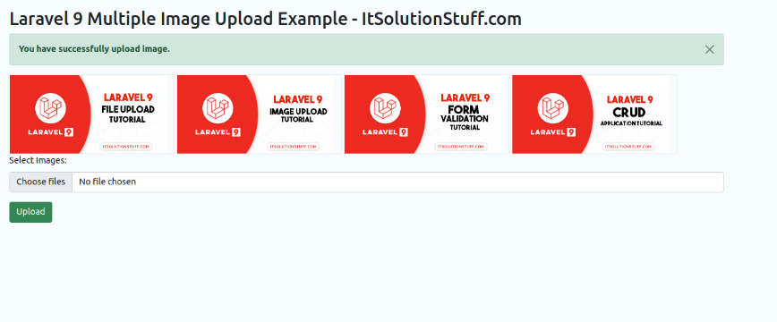

# laravel9_multiple_image_upload
## 1. Install Laravel 9
```Dockerfile
composer create-project laravel/laravel example-app
```
## 2. Create Migration and Model
```Dockerfile
php artisan make:migration create_images_table
```
- Vào database/migrations/2022_02_10_140040_create_images_table.php
```Dockerfile
<?php
  
use Illuminate\Database\Migrations\Migration;
use Illuminate\Database\Schema\Blueprint;
use Illuminate\Support\Facades\Schema;
  
return new class extends Migration
{
    /**
     * Run the migrations.
     *
     * @return void
     */
    public function up()
    {
        Schema::create('images', function (Blueprint $table) {
            $table->id();
            $table->string('name');
            $table->timestamps();
        });
    }
  
    /**
     * Reverse the migrations.
     *
     * @return void
     */
    public function down()
    {
        Schema::dropIfExists('images');
    }
};
```
- Chạy lệnh tạo bảng và model:
```Dockerfile
php artisan migrate
```
```Dockerfile
php artisan make:model Image
```
- Vào app/Models/Image.php
```Dockerfile
<?php
  
namespace App\Models;
  
use Illuminate\Database\Eloquent\Factories\HasFactory;
use Illuminate\Database\Eloquent\Model;
  
class Image extends Model
{
    use HasFactory;
  
    protected $fillable = [
        'name'
    ];
}
```
## 3. Create Controller
```Dockerfile
php artisan make:controller ImageController
```
- Vào file controlle app/Http/Controllers/ImageController.php
```Dockerfile
<?php
  
namespace App\Http\Controllers;
  
use Illuminate\Http\Request;
use App\Models\Image;
  
class ImageController extends Controller
{
    /**
     * Display a listing of the resource.
     *
     * @return \Illuminate\Http\Response
     */
    public function index()
    {
        return view('imageUpload');
    }
      
    /**
     * Display a listing of the resource.
     *
     * @return \Illuminate\Http\Response
     */
    public function store(Request $request)
    {
        $request->validate([
            'images' => 'required',
            'images.*' => 'required|image|mimes:jpeg,png,jpg,gif,svg|max:2048',
        ]);
      
        $images = [];
        if ($request->images){
            foreach($request->images as $key => $image)
            {
                $imageName = time().rand(1,99).'.'.$image->extension();  
                $image->move(public_path('images'), $imageName);
  
                $images[]['name'] = $imageName;
            }
        }
  
        foreach ($images as $key => $image) {
            Image::create($image);
        }
      
        return back()
                ->with('success','You have successfully upload image.')
                ->with('images', $images); 
    }
}
```
Lưu trữ hình ảnh trong thư mục lưu trữ(Storage Folder)

```Dockerfile
$image->storeAs('images', $imageName);
// storage/app/images/file.png
```

Lưu trữ Hình ảnh trong Thư mục Public
```Dockerfile
$image->move(public_path('images'), $imageName);
// public/images/file.png
```
Lưu trữ hình ảnh trong S3

```Dockerfile
$image->storeAs('images', $imageName, 's3');
```
## 4.Create and Add Routes
- Vào routes/web.php
```Dockerfile
<?php
  
use Illuminate\Support\Facades\Route;
  
use App\Http\Controllers\ImageController;
  
/* 
|--------------------------------------------------------------------------
| Web Routes
|--------------------------------------------------------------------------
|
| Here is where you can register web routes for your application. These
| routes are loaded by the RouteServiceProvider within a group which
| contains the "web" middleware group. Now create something great!
|
*/
  
Route::controller(ImageController::class)->group(function(){
    Route::get('image-upload', 'index');
    Route::post('image-upload', 'store')->name('image.store');
});
```
## 5.Create Blade File
- Vào resources/views/imageUpload.blade.php
```Dockerfile
<!DOCTYPE html>
<html>
<head>
    <title>Laravel 9 Multiple Image Upload Example - ItSolutionStuff.com</title>
    <link href="https://cdn.jsdelivr.net/npm/bootstrap@5.0.2/dist/css/bootstrap.min.css" rel="stylesheet">
</head>
      
<body>
<div class="container">
       
    <div class="panel panel-primary">
  
      <div class="panel-heading">
        <h2>Laravel 9 Multiple Image Upload Example - ItSolutionStuff.com</h2>
      </div>
  
      <div class="panel-body">
       
        @if ($message = Session::get('success'))
            <div class="alert alert-success alert-dismissible fade show" role="alert">
              <strong>{{ $message }}</strong>
              <button type="button" class="btn-close" data-bs-dismiss="alert" aria-label="Close"></button>
            </div>
  
            @foreach(Session::get('images') as $image)
                
            @endforeach
        @endif
      
        <form action="{{ route('image.store') }}" method="POST" enctype="multipart/form-data">
            @csrf
  
            <div class="mb-3">
                <label class="form-label" for="inputImage">Select Images:</label>
                <input 
                    type="file" 
                    name="images[]" 
                    id="inputImage"
                    multiple 
                    class="form-control @error('images') is-invalid @enderror">
  
                @error('images')
                    <span class="text-danger">{{ $message }}</span>
                @enderror
            </div>
   
            <div class="mb-3">
                <button type="submit" class="btn btn-success">Upload</button>
            </div>
       
        </form>
      
      </div>
    </div>
</div>
</body>
    
</html>
```
## 5. Chạy project

```Dockerfile
php artisan serve
```
-  Vào 
http://localhost:8000/image-upload


